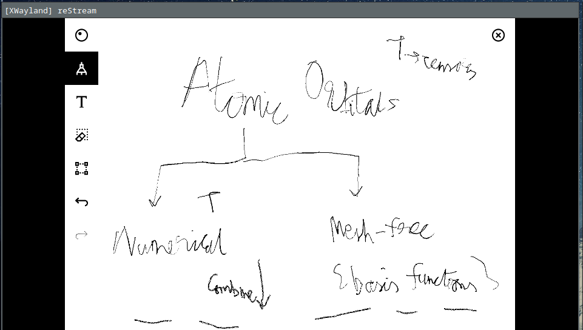

#+author: Rohit Goswami
#+hugo_base_dir: ../
#+hugo_front_matter_format: yaml
#+hugo_weight: nil
#+hugo_front_matter_key_replace: description>summary
#+hugo_auto_set_lastmod: t
#+bibliography: biblio/refs.bib

#+seq_todo: TODO DRAFT DONE
#+seq_todo: TEST__TODO | TEST__DONE

#+property: header-args :eval never-export

#+startup: logdone indent overview inlineimages

#+hugo_section: ./snippets

* Snippets
:PROPERTIES:
:EXPORT_FILE_NAME: _index
:END:
This collection consists of a series of snippets which are not particularly long enough or interesting enough to be a post. However, they are frequently used by me, and thus deserve a spot somewhere.
* Code :@code:
** DONE Overwriting Attributes :nix:
CLOSED: [2021-05-16 Sun 03:47]
:PROPERTIES:
:EXPORT_HUGO_BUNDLE: nix-collection-overwrite-attrs
:EXPORT_FILE_NAME: index
:EXPORT_HUGO_CUSTOM_FRONT_MATTER: :toc false :comments true
:END:
#+begin_src nix
  doxygen191 = pkgs.doxygen.overrideAttrs (_: rec {
  name = "doxygen-1.9.1";
  src = pkgs.fetchurl {
    urls = [
      "mirror://sourceforge/doxygen/${name}.src.tar.gz" # faster, with https, etc.
      "http://doxygen.nl/files/${name}.src.tar.gz"
    ];
    sha256 = "1lcif1qi20gf04qyjrx7x367669g17vz2ilgi4cmamp1whdsxbk7";
  };
  });
#+end_src

** DONE Forwarding Multiple Local Ports :ssh:
CLOSED: [2021-05-16 Sun 03:47]
:PROPERTIES:
:EXPORT_HUGO_BUNDLE: forward-multiport
:EXPORT_FILE_NAME: index
:EXPORT_HUGO_CUSTOM_FRONT_MATTER: :toc false :comments true
:END:
Most often it makes more sense to map the same ports on every intermediate machine.
#+begin_src conf
Host super
  Hostname super.machine.location.is
  IdentityFile ~/.ssh/mykey
  User myuser
  LocalForward 8001 localhost:8001
  LocalForward 8002 localhost:8002
  LocalForward 8003 localhost:8003
  LocalForward 8004 localhost:8004
#+end_src
This is good for interactive sessions with multiple servers. For single servers, reverse proxy tunnels are more efficient.
** DONE Programming Language Management :shell:lang:
CLOSED: [2021-09-19 Sun 17:39]
:PROPERTIES:
:EXPORT_HUGO_BUNDLE: prog-lang-man
:EXPORT_FILE_NAME: index
:EXPORT_HUGO_CUSTOM_FRONT_MATTER: :toc false :comments true
:END:
~nix~ aside[fn:whynot], I recently shifted to using [[https://asdf-vm.com/guide/getting-started.html#_3-install-asdf][asdf]] to manage different language versions.
#+begin_src bash
git clone https://github.com/asdf-vm/asdf.git ~/.asdf --branch v0.8.1
#+end_src
The main reason to prefer ~asdf~ over competing language specific options like ~rvm~ or ~pyenv~ or ~nvm~ and company is simply uniformity of the interface. This can be coupled with ~zinit snippet OMZ::plugins/asdf~ for loading the completions. Note that the installation steps can take a while especially if ~openssl~ is being installed.
*** Configuration
Actually one weird aspect of ~asdf~ is that it pollutes ~$HOME~ by default
instead of respectfully storing its configuration in ~$HOME/.config/asdf~ like
every other program. To change this; exporting ~ASDF_CONFIG_FILE~ works.
Essentially a ~zsh~ configuration with ~zinit~ would look like this[fn:whatwhy]:
#+begin_src bash
if [[ ! -d ~/.asdf ]]; then
    mkdir ~/.asdf
    git clone https://github.com/asdf-vm/asdf.git ~/.asdf
fi

export ASDF_CONFIG_FILE="~/.config/asdf/asdfrc"
zinit snippet OMZ::plugins/asdf
#+end_src

~asdf~ has an option; ~legacy_version_file = yes~ which is meant to ensure that
existing solutions (e.g. ~.nvmrc~ or ~.node-version~) are compatible. There is
also ~$HOME/.tool-versions~ for trickle-down language versions; that is
language-version pairs defined in such files are activated for the directory and
lower sub-directories. The rest of a reasonable configuration ([[https://asdf-vm.com/manage/configuration.html][described here]])
might look like:
#+begin_src bash
legacy_version_file = yes
always_keep_download = no
#+end_src
*** Ruby
This [[https://github.com/asdf-vm/asdf-ruby][plugin]] leverages [[https://github.com/rbenv/ruby-build#custom-build-configuration][ruby-build]] and so can take a pick up an extended set of
environment variables; it supports ~.ruby-version~ files as well.
#+begin_src bash
asdf plugin add ruby
asdf list all ruby
asdf install ruby 3.0.2
asdf global ruby 3.0.2 # Convenience
#+end_src
*** NodeJS
This [[https://github.com/asdf-vm/asdf-nodejs][plugin]] respects ~.nvmrc~ and ~.node-version~ files.
#+begin_src bash
asdf plugin add nodejs
asdf global nodejs latest
asdf install nodejs latest
#+end_src
*** Python
Builds with [[https://github.com/yyuu/pyenv/tree/master/plugins/python-build][python-build]].
#+begin_src bash
asdf plugin add python
asdf install python 3.9.7
asdf global python 3.9.7
#+end_src
*** Direnv
I'm a huge fan of ~direnv~; and a [[https://github.com/asdf-community/asdf-direnv][fantastic little plugin]] (with neat ~hyperfine~ benchmarks) for ~asdf~ removes a layer of shim indirection while playing nicely with ~direnv~.
#+begin_src bash
asdf plugin-add direnv
asdf install direnv latest
asdf global direnv latest
#+end_src
This comes with an associated set of shell profile instructions:
#+begin_src bash
# File: ~/.zshrc
# Hook direnv into your shell.
eval "$(asdf exec direnv hook zsh)"
# A shortcut for asdf managed direnv.
direnv() { asdf exec direnv "$@"; }
#+end_src
Along with a commiserate ~$HOME/.config/direnv/direnvrc~ requirement:
#+begin_src bash
source "$(asdf direnv hook asdf)"
#+end_src
Now every new ~.envrc~ can start with ~use asdf~ which will now speed up evaluations.
*** Conclusions
This method appears to be more robust than remembering the various idiosyncrasies and logic of a host of other tools.

[fn:whatwhy] This structure can be seen in [[https://github.com/HaoZeke/Dotfiles][my own Dotfiles]] as well
[fn:whynot] This was during the [[https://github.com/Ericson2314/nix-rfcs/blob/plan-dynamism/rfcs/0000-plan-dynanism.md][build plan dynamism RFCs]] which themselves were symptomatic of the ~{yarn,composer,node,*}2nix~ issues
** DONE Watching Files :productivity:cmdline:ruby:rust:
CLOSED: [2021-09-19 Sun 17:39]
:PROPERTIES:
:EXPORT_HUGO_BUNDLE: watch-files
:EXPORT_FILE_NAME: index
:EXPORT_HUGO_CUSTOM_FRONT_MATTER: :toc false :comments true
:END:
My personal favorite for watching files and running context sensitive commands is to use the lovely [[https://github.com/filewatcher/filewatcher][filewatcher CLI utility]] written in Ruby.
#+begin_src bash
gem install filewatcher
gem install filewatcher-cli
#+end_src
This can then be used with:
#+begin_src bash
filewatcher '**/*.js' 'node $FILENAME'
#+end_src
However this hasn't been updated in a while now *and fails* on newer versions of Ruby. So now I use [[https://github.com/watchexec/watchexec/tree/main/cli#installation][watchexec]].
#+begin_src bash
cargo install watchexec-cli
watchexec -w source/f2py 'make html'
#+end_src
** DONE Docker Development Environments :devenv:cmdline:
CLOSED: [2021-11-24 Wed 16:20]
:PROPERTIES:
:EXPORT_HUGO_BUNDLE: docker-dev-envs
:EXPORT_FILE_NAME: index
:EXPORT_HUGO_CUSTOM_FRONT_MATTER: :toc false :comments true
:END:
Very quick set of ugly commands to grab build environments. A much better
approach is to make a custom Dockerfile or even better, use ~nix~.

However it does work in a pinch.
#+begin_src bash
docker pull IMG:TAG
sudo docker run -v LOCALDIR:DIRINDOCKER -it debian:experimental-20211115 bash
# Don't be root for long
apt update
apt install sudo vim zsh
# Use the same username --> easier to manage permissions
useradd -m -s /bin/zsh $USER -G sudo
passwd $USER # Some crap
# Or just add to the sudoers file
echo "$USER ALL=(ALL:ALL) ALL" >> /etc/sudoers
su $USER
# numpy stuff
sudo apt install gcc gfortran libopenblas-dev python3.10-dev python3.10-dbg git python3-distutils python3-setuptools libx11-dev build-essential pkg-config python3-pip python3-pytest python3-hypothesis
python3.10-dbg runtests.py -s f2py -vvv
#+end_src
** DONE SSH Port Forwarding :ssh:
CLOSED: [2021-11-24 Wed 16:20]
:PROPERTIES:
:EXPORT_HUGO_BUNDLE: ssh-port-forwarding
:EXPORT_FILE_NAME: index
:EXPORT_HUGO_CUSTOM_FRONT_MATTER: :toc false :comments true
:END:
Whenever I need to access a server running on an HPC which does not support ~ngrok~ or ~localtunnel~ or even ~gsocket~; the fallback approach is always to rely on SSH port forwarding.

The sample problem here is running an HTTP server for viewing graphics in R via ~httpgd~.
#+begin_src bash
# Local
export PORT=9899 && ssh -L "${PORT}:localhost:${PORT}" "rog32@krafla.rhi.hi.is" -N -L "${PORT}:localhost:${PORT}" elja
# New tab
ssh krafla
ssh elja
radian # or R
#+end_src
Now in ~R~.
#+begin_src R
library("httpgd")
# else install.packages(c("httpgd"), repos='https://cran.hafro.is/')
hgd(port=9899)
#+end_src
*** Conda and R
Annoyingly if you are depending on ~conda~ or ~micromamba~ or some variant thereof on the remote sever then ~install.packages~ will fail and instead the environment needs to have the corresponding ~R~ packages installed after searching [[https://anaconda.org/][anaconda.org]].
#+begin_src bash
# minimal
micromamba create -p $(pwd)/.tmp -c conda-forge r-tidyverse  git R
micromamba activate $(pwd)/.tmp
micromamba install -c nclibz r-httpgd
#+end_src

These issues are not present when using a ~nix-shell~.
** DONE Mach-Nix and Shell Environments :nix:python:cmdline:
CLOSED: [2022-01-17 Mon 02:28]
:PROPERTIES:
:EXPORT_HUGO_BUNDLE: mach-nix-shell-env
:EXPORT_FILE_NAME: index
:EXPORT_HUGO_CUSTOM_FRONT_MATTER: :toc false :comments true
:END:
I often need to set up quick virtual environments. Unfortunately, the standard
approach to work with this in ~nix~ deals with the local ~nixpkgs~ mechanism for
~python~ dependencies:
#+begin_src bash
nix-shell -p "python38.withPackages(ps: [ ps.numpy ps.sh ])"
#+end_src
However there is a catch for packages which are not officially present upstream.
#+begin_src bash
# Fails!
nix-shell -p "python38.withPackages(ps: [ ps.numpy ps.sh ps.lieer ])"
#+end_src
However, the ~mach-nix~ project can indeed be used to work around this, at the
cost of a somewhat longer command.
#+begin_src bash
# Works
nix-shell -p '(callPackage (fetchTarball https://github.com/DavHau/mach-nix/tarball/3.0.2) {python="python38";}).mkPython{requirements="numpy\n lieer\n ipython";}' --command ipython
#+end_src
~mkPythonShell~ does not generate an environment which can be used here, since
that is not a derivation which can be built.  This is most useful in the context
of systems which use ~asdf~ or other ~PATH~ shim approaches.
** DONE Auto-discovering ~meson~ tests :meson:cpp:build:tests:
CLOSED: [2023-03-22 Wed 13:59]
:PROPERTIES:
:EXPORT_HUGO_BUNDLE: auto-disc-meson-tests
:EXPORT_FILE_NAME: index
:EXPORT_HUGO_CUSTOM_FRONT_MATTER: :toc false :comments true
:END:

One of the things I missed when I migrated from ~cmake~ to ~meson~ was the ease
at which ~cmake~ discovers tests.

#+begin_src cmake
# Tests
option(PACKAGE_TESTS "Build the tests" OFF)
if(PACKAGE_TESTS)
  find_package(GTest REQUIRED)
  enable_testing()
  include(GoogleTest)
  add_subdirectory(gtests)
endif()
#+end_src

Thankfully, ~meson~ can kind of emulate this behavior, even in its restricted
syntax. The key concept is **arrays** and their iterators.

#+begin_src meson
test_array = [#
  # ['Pretty name', 'binary_name', 'BlahTest.cpp']
  ['String parser helpers', 'strparse_run', 'StringHelpersTest.cpp'],
  ['Improved Dimer', 'impldim_run', 'ImpDimerTest.cpp'],
]
foreach test : test_array
  test(test.get(0),
       executable(test.get(1),
          sources : ['gtests/'+test.get(2)],
          dependencies : [ prog_deps, gtest_dep, gmock_dep ],
          link_with : proglib,
          cpp_args : prog_extra_args
                 ),
      )
endforeach
#+end_src

Now this is pretty neat already, but we can go a step further and augment this
with a working directory concept.

#+begin_src meson
test_array = [#
  # ['Pretty name', 'binary_name', 'BlahTest.cpp', 'working_dir']
  ['Improved Dimer', 'impldim_run', 'ImpDimerTest.cpp', '/gtests/data/'],
  ['Matter converter', 'matter_run', 'MatterTest.cpp', '/gtests/data/systems/sulfolene'],
  ['String parser helpers', 'strparse_run', 'StringHelpersTest.cpp', ''],
]
foreach test : test_array
  test(test.get(0),
       executable(test.get(1),
          sources : ['gtests/'+test.get(2)],
          dependencies : [ prog_deps, gtest_dep, gmock_dep ],
          link_with : proglib,
          cpp_args : prog_extra_args
                 ),
        workdir : meson.source_root() + test.get(3)
      )
endforeach
#+end_src

This is rather satisfying. Combined with some ~wraps~, it is also pretty
portable.

*** Addenum: Tests with arguments

Recently, some ~openblas~ work made me rethink how ~meson~ handles tests and arguments. It turns out something relatively simple in ~make~:
#+begin_src makefile
xblat2s: sblat2.o $(BLASLIB)
	$(FC) $(FFLAGS) $(LDFLAGS) -o $@ $^
run: all
	./xblat2s < sblat2.in
#+end_src

Is rather complicated to emulate directly within ~meson~. A wrapper is required, first in ~C~:

#+begin_src C
#include <stdio.h>
#include <stdlib.h>
#include <string.h>

int main(int argc, char *argv[]) {
    if (argc != 3) {
        fprintf(stderr, "Usage: %s <executable> <input_file>\n", argv[0]);
        return EXIT_FAILURE;
    }

    char command[1024];
    snprintf(command, sizeof(command), "%s < %s", argv[1], argv[2]);

    int result = system(command);
    if (result != 0) {
        fprintf(stderr, "Error: Command '%s' failed with return code %d.\n", command, result);
        return EXIT_FAILURE;
    }

    return EXIT_SUCCESS;
}
#+end_src

Which can then be used within ~meson~:

#+begin_src meson
_blas_input_test_array = [#
  # ['Pretty name', 'binary_name', 'BlahTest.cpp', 'inputfile.in']
  ['Test REAL Level 2 BLAS', 'xblat2s', 'sblat2.f', 'sblat2.in'],
]
test_runner = executable('run_test',
                         sources: ['run_test.c'],
                         install: false)
# NOTE: For the tests to pass the executables need to be compiled first
foreach _test : _blas_input_test_array
  executable(_test.get(1),
             sources : _test.get(2),
             link_with : netlib_blas,
            )
  test_exe = meson.current_build_dir() / _test.get(1)
  input_file = meson.source_root() + '/lapack-netlib/BLAS/TESTING/' + _test.get(3)
  test(_test.get(0), fortran_test_runner,
       args: [test_exe, input_file],
       workdir: meson.current_build_dir())
endforeach
#+end_src

However, the main pain point with this is that the executables are not exactly
test dependencies so this fails if the entire project hasn't been compiled
before running the tests. Still a pretty minor caveat.

** DONE Catch2 and ~meson~ :meson:cpp:build:tests:
CLOSED: [2025-07-26 Sat 19:58]
:PROPERTIES:
:EXPORT_HUGO_BUNDLE: catch2-meson-tests
:EXPORT_FILE_NAME: index
:EXPORT_HUGO_CUSTOM_FRONT_MATTER: :toc false :comments true
:END:
When specifying ~main~ manually, this will suffice:
#+begin_src meson
test_deps = _deps + dependency('Catch2')
#+end_src
Which will pick up the ~pkgconfig~ configuration typically. However, to use the
~main~ which comes with ~catch2~ it is easier to use ~cmake~:
#+begin_src meson
test_deps += dependency(
  'Catch2',
  method: 'cmake',
  modules: ['Catch2::Catch2WithMain'],
)
#+end_src
The rest of the tests can be setup via auto-discovery [[https://rgoswami.me/snippets/auto-disc-meson-tests/][as discussed before]].
** DONE Zotero Connector and Blog Posts :zotero:references:
CLOSED: [2023-08-23 Wed 00:17]
:PROPERTIES:
:EXPORT_HUGO_BUNDLE: zotero-connector-blog-posts
:EXPORT_FILE_NAME: index
:EXPORT_HUGO_CUSTOM_FRONT_MATTER: :toc false :comments true
:END:
It so happens that *only* a precious few generators are recognized for parsing blog-post entries into Zotero, that is:
#+begin_src html
<meta name=generator content="Wordpress">
<!-- or  -->
<meta name=generator content="Blogger">
<!-- or  -->
<meta name=generator content="Wooframework">
#+end_src
This is really rather silly to put on say, a ~hugo~ generated site, but since
the embedded metadata-parsing is so much better, it kind of makes sense to do so
as a stop gap solution.

The code which handles these ~meta~ tags for ~blogPosts~ can be [[https://github.com/zotero/translators/blob/b6eb8802779a538752435f567a6c1461d87cdfac/Embedded%20Metadata.js#L306-L313][seen upstream]].
Will be fixed by [[https://github.com/zotero/translators/pull/3116][this PR]] soon enough hopefully.
** DONE Local ~precommit~ dependencies :build:packaging:precommit:
CLOSED: [2023-11-01 Wed 04:33]
:PROPERTIES:
:EXPORT_HUGO_BUNDLE: local-precommit-dependencies
:EXPORT_FILE_NAME: index
:EXPORT_HUGO_CUSTOM_FRONT_MATTER: :toc false :comments true
:END:
Recently a bunch of my pre-commit CI jobs started failing due to dependency
resolution issues. The easiest way to ensure reliable usage is to have locally
installed tools used. Consider:
#+begin_src yaml
- repo: https://github.com/pocc/pre-commit-hooks
  rev: v1.3.5
  hooks:
    - id: cppcheck
      args: ["--error-exitcode=1"]
#+end_src
Which leaves one dependent on an external repo. This can be rewritten as:
#+begin_src yaml
- repo: local
  hooks:
    - id: cppcheck
      name: cppcheck
      entry: cppcheck
      language: system
      types_or: [c++, c]
      args: ["--error-exitcode=1"]
#+end_src
With this local setup, it is necessary to adjust the CI configuration:
#+begin_src yaml
name: pre-commit
on:
  pull_request:
  push:
    branches: [main]
jobs:
  pre-commit:
    runs-on: ubuntu-latest
    steps:
    - uses: actions/checkout@v4
    - name: Install Conda environment
      # Using a lock file is optional but heavily recommended
      uses: mamba-org/setup-micromamba@v1
      with:
        environment-file: conda-lock.yml
        environment-name: ci
    - name: Run precommit
      shell: bash -l {0}
      run: |
        pipx run pre-commit run -a
#+end_src
This ensures the ~pre-commit~ action is executed within the ~conda~ environment,
which is assumed to have ~pipx~ and the dependencies present.
** DONE ~precommit~ selections :regex:precommit:
CLOSED: [2025-07-26 Sat 19:59]
:PROPERTIES:
:EXPORT_HUGO_BUNDLE: precommit-selections
:EXPORT_FILE_NAME: index
:EXPORT_HUGO_CUSTOM_FRONT_MATTER: :toc false :comments true
:END:
~pre-commit~ accepts ~exclude~ keys which take ~python~ [[https://pre-commit.com/#regular-expressions][regular expressions]],
typically designed with [[https://regex101.com/][regex101]]. For example:
#+begin_src yaml
exclude: |
  (?x)(
  thirdparty| # vendored
  xtb.h| # vendored
  )
- id: clang-format
  name: clang-format
  entry: clang-format
  language: system
  types_or: [c, c++, cuda]
  args: ["-fallback-style=none", "-style=file", "-i"]
#+end_src
While it is especially useful for tools which don't have ignore flags, as a
convention:
- Use a globally defined ~exclude~
  + Explain the exclusion with a comment
- Fine-tune with per-hook ~types_or~ (or even ~files~)
  + Additional ~exclude~ keys may be used as well
** DRAFT C++ ~precommit~ hooks :regex:cpp:precommit:
:PROPERTIES:
:EXPORT_HUGO_BUNDLE: precommit-cpp
:EXPORT_FILE_NAME: index
:EXPORT_HUGO_CUSTOM_FRONT_MATTER: :toc false :comments true
:END:
Generally, combined with [[https://rgoswami.me/snippets/local-precommit-dependencies/][local dependencies]] and [[~precommit~ selections][exclusion rules]], the followi
#+begin_src yaml
- repo: local
  hooks:
    - id: cppcheck
      name: cppcheck
      entry: cppcheck
      language: system
      types_or: [c++, c]
      args: [
      "--error-exitcode=1",
      "--std=c++20",
      "--language=c++",
      "--check-level=exhaustive",
      ]
    - id: cpplint
      name: cpplint
      entry: cpplint
      language: system
      types_or: [c++, c]
      args: [
      "--filter=-whitespace/comments,
      -build/namespaces,"
      ]
    - id: clang-format
      name: clang-format
      entry: clang-format
      language: system
      types_or: [c, c++, cuda]
      args: ["-fallback-style=none", "-style=file", "-i"]
#+end_src
** DRAFT C++ ~precommit~ hooks for ~meson~ :meson:build:precommit:
:PROPERTIES:
:EXPORT_HUGO_BUNDLE: precommit-meson-hooks
:EXPORT_FILE_NAME: index
:EXPORT_HUGO_CUSTOM_FRONT_MATTER: :toc false :comments true
:END:
#+begin_src yaml
- id: meson-format
  name: meson format
  entry: meson
  language: system
  types: [meson]
  files: \.build$
  args: ["format", "-i"]
#+end_src
** DRAFT Using meson subprojects for CMake dependencies
#+begin_src meson
cmake = import('cmake')
opt_var = cmake.subproject_options()
opt_var.add_cmake_defines({'CMAKE_BUILD_TYPE': 'Release', 'Boost_USE_STATIC_LIBS': 'OFF'})

cmcachelot = cmake.subproject('cachelot', options: opt_var)
message('CMake targets:\n - ' + '\n - '.join(cmcachelot.target_list()))
_deps += cmcachelot.dependency('cachelot')
#+end_src
** DONE Off the shelf OCR and Deep Learning :python:ocr:tex:
CLOSED: [2023-11-15 Wed 19:06]
:PROPERTIES:
:EXPORT_HUGO_BUNDLE: oshelf-ocr-dl
:EXPORT_FILE_NAME: index
:EXPORT_HUGO_CUSTOM_FRONT_MATTER: :toc false :comments true
:END:
In general, ~detexify~ ([[https://detexify.kirelabs.org/classify.html][here]]) and [[https://rgoswami.me/posts/managing-scanned-books/][my ScanTools workflow]] is great. However,
sometimes more can be done.
#+begin_src bash
micromamba create -n textocr
micromamba activate textocr
micromamba install torchvision -c pytorch
pip install pix2tex[gui]
pip install python-doctr
pip install nougat-ocr
#+end_src

The ~TeX~ tool ([[https://lukas-blecher.github.io/LaTeX-OCR][LaTeX OCR]]) works great even via the terminal. The ~doctr~
library is a bit more finicky, but can be a decent way to extract plain text when regular OCR tools fail (e.g. ~ocrmypdf~).
#+begin_src python
import argparse
from pathlib import Path
from doctr.io import DocumentFile
from doctr.models import ocr_predictor

def process_pdf(pdf_path):
    model = ocr_predictor(
        det_arch="db_resnet50", reco_arch="crnn_vgg16_bn", pretrained=True
    )
    doc = DocumentFile.from_pdf(pdf_path)
    result = model(doc)
    return result.render()

def save_to_text(input_path, output_text):
    output_file = Path(input_path).with_suffix(".txt")
    output_file.write_text(output_text, encoding="utf-8")

def main():
    parser = argparse.ArgumentParser(description="OCR processing of a PDF file")
    parser.add_argument("pdf_file", help="Path to the PDF file to be processed")
    args = parser.parse_args()
    ocr_result = process_pdf(args.pdf_file)
    save_to_text(args.pdf_file, ocr_result)

if __name__ == "__main__":
    main()
#+end_src
Which is alright, called via ~python -c doctr_runner.py blah.pdf~.

Or [[https://github.com/facebookresearch/nougat][Meta's nougat]], which is slower but generally better formatted:
#+begin_src bash
nougat blah.pdf -o output_dir
#+end_src

As of ~15-11-2023~, both these options have [[https://github.com/facebookresearch/nougat/issues/162][a known warning]] about a memory leak.
** DONE Faster manual tests with ~popd~ :devenv:cmdline:
CLOSED: [2023-11-19 Sun 23:34]
:PROPERTIES:
:EXPORT_HUGO_BUNDLE: manual-tests-popd-spin
:EXPORT_FILE_NAME: index
:EXPORT_HUGO_CUSTOM_FRONT_MATTER: :toc false :comments true
:END:
Both NumPy and SciPy use ~spin~ as a frontend to call ~meson~ and this can be
used to setup a shell. The good thing is that invoking ~exit~ will return to the
directory from which ~spin~ was run. To toggle between directories (e.g. a
folder with a bug / issue reprex) and the rebuild quickly ~popd~ is  useful.
#+begin_src bash
# Generate reprex for bug
cd ~/Git/Github/BuggyNP/gh2322/
vim buggy.f90
python whatever.py
# whatever to reproduce the bug
cd ~/Git/Github/NumPy
# Make changes, rebuild
spin run $SHELL
popd
# returned to the gh2322 folder, test
python whatever.py
exit
# returns to NumPy root
vim README.md
spin run $SHELL
popd
# and so on...
#+end_src
Naturally these tools, and ~popd~ is more general and can be used for a lot more
but this is pretty nifty too.
** DONE Jupyter ~data~ helpers :devenv:jupyter:python:
CLOSED: [2024-04-15 Mon 00:44]
:PROPERTIES:
:EXPORT_HUGO_BUNDLE: jup-dat-helper
:EXPORT_FILE_NAME: index
:EXPORT_HUGO_CUSTOM_FRONT_MATTER: :toc false :comments true
:END:
Often my notebooks are organized with respect to ~GITROOT~, so this snippet
makes for an easy way to construct relative paths.
#+begin_src python
gitroot = Path(subprocess.run(["git", "rev-parse", "--show-toplevel"],
                         check=True,
                         capture_output=True).stdout.decode("utf-8").strip())
# Usage
exdata = gitroot / "data" / "very_important_folder"
#+end_src
For packages which demand string only paths, another helper can be used in tandem.
#+begin_src python
def getstrform(pathobj):
    return str(pathobj.absolute())
#+end_src
Along with a context manager for running commands in a particular directory (kanged from my ~f2py~ utilities):
#+begin_src python
@contextlib.contextmanager
def switchdir(path):
    curpath = Path.cwd()
    os.chdir(path)
    try:
        yield
    finally:
        os.chdir(curpath)
#+end_src

*EDIT*: These are now part of my ~pycrumbs~ (aka ~pycrumpets~) helper library..
** DONE reMarkable Screen Sharing :devenv:cmdline:ssh:collab:
CLOSED: [2024-06-15 Sat 20:55]
:PROPERTIES:
:EXPORT_HUGO_BUNDLE: rm2-ss
:EXPORT_FILE_NAME: index
:EXPORT_HUGO_CUSTOM_FRONT_MATTER: :toc false :comments true
:END:
Basically followed along the directions for [[https://github.com/rien/reStream?tab=readme-ov-file][reStream]] [fn:notoltec].
- Got the SSH root password and IP from ~Settings > Help > Copyrights and licenses > General information (scroll to the bottom)~
- Added the IP to the pass store via ~pass insert REMARKABLE_IP~
  + Queried via ~pass REMARKABLE_IP~
- Added an ~ecdsa~ key, ~ssh-keygen -t ecdsa -C "MYMAIL" -f ~/.ssh/remarkable~
  + ~ssh-copy-id -i ~/.ssh/remarkable root@$(pass REMARKABLE_IP)~

The only slight point of deviation was using ~chezmoi~ to grab the local script [fn:alldots]:
#+begin_src sh
{{ if ne .chezmoi.os "windows" -}}
zinit ice from"gh-r" as"program" bpick"*.sh" mv"restream.sh -> reStream"
zinit light rien/reStream
{{ end -}}
#+end_src

Setting the actual binary on the reMarkable was also by the book (very thorough
instructions):
#+begin_src sh
scp restream.arm.static root@$(pass REMARKABLE_IP):/home/root/restream
ssh root@$(pass REMARKABLE_IP) 'chmod +x /home/root/restream'
#+end_src

With this, finally getting the shared window is a snap, as seen in Figure [[fig:remarkSSHView]]:
#+begin_src sh
REMARKABLE_IP=$(pass REMARKABLE_IP) reStream -p
#+end_src

#+NAME: fig:remarkSSHView
#+LABEL: fig:remarkSSHView
#+DOWNLOADED: screenshot @ 2024-06-15 21:00:21
#+CAPTION: Success!!! No clue what I was scribbling though..

[fn:alldots] All my dotfiles [[https://github.com/HaoZeke/Dotfiles/tree/chezmoi][are here]]
[fn:notoltec] Unfortunately, ~toltec~ doesn't support OS versions 3.x and up... [[https://github.com/toltec-dev/toltec/discussions/673][yet]]
** DONE Dual-boot Bitlocker Drives :config:archlinux:encryption:dualboot:win:
CLOSED: [2024-07-28 Sun 14:33]
:PROPERTIES:
:EXPORT_HUGO_BUNDLE: db-btl-drives
:EXPORT_FILE_NAME: index
:EXPORT_HUGO_CUSTOM_FRONT_MATTER: :toc false :comments true
:END:
~cryptsetup~ has partial support for ~bitlocker~ encrypted drives, but
~dislocker~ works better with dual booted machines.

Crucially ~cryptsetup~
doesn't work with partially encrypted drives.

#+begin_src bash
cryptsetup --version
# cryptsetup 2.7.3 flags: UDEV BLKID KEYRING KERNEL_CAPI HW_OPAL
sudo cryptsetup --type bitlk open /dev/nvme0n1p3 windows
# Activation of partially decrypted BITLK device is not supported.
#+end_src

Usage of ~dislocker~ is rather straightforward[fn:1].

#+begin_src bash
sudo mkdir -p /media/{bitlocker,Windows}
# Get the Bitlocker drive, assumes there's only one
export BTLDRIVE=$(blkid | grep "BitLocker" | awk '{print $1}' | sed 's/://')
sudo dislocker -v -V $BTLDRIVE -- /media/bitlocker
# Type might also be exfat depending on the configuration
sudo mount -t ntfs-3g -o loop,rw /media/bitlocker/dislocker-file /media/Windows/
#+end_src

Cleanup is equally straightforward, where the inner drive needs to be unmounted before the outer one.

#+begin_src bash
sudo umount /media/{Windows,bitlocker}
#+end_src

[fn:1] From this [[https://www.baeldung.com/linux/bitlocker-encrypted-device][reference article]] and the Kali Linux [[https://www.kali.org/tools/dislocker/][page]].
** DONE Sharing Bluetooth Keys :dualboot:config:win:
CLOSED: [2024-07-28 Sun 14:52]
:PROPERTIES:
:EXPORT_HUGO_BUNDLE: share-db-bluetooth-keys
:EXPORT_FILE_NAME: index
:EXPORT_HUGO_CUSTOM_FRONT_MATTER: :toc false :comments true
:END:
Re-pairing bluetooth devices in Windows and Linux is annoying. [fn:1] The ArchWiki
article on [[https://wiki.archlinux.org/title/Bluetooth_mouse][bluetooth mouse management]] provides a link to a [[https://gist.github.com/5shekel/8b4998a69903438a6aac2f01a44463d3][helpful gist]]. Combined with the bitlocker [[Dual-boot Bitlocker Drives][setup described earlier]], and this patch:
#+begin_src bash
wget "https://gist.githubusercontent.com/5shekel/8b4998a69903438a6aac2f01a44463d3/raw/622a55c3a5bc1929369047c831a3f10e6988a195/export-ble-infos.py"
# Comment out config['LocalSignatureKey']['Key'] = read_reg('CSRK', 'hex16')
# If there's an error
python export-ble-infos.py -s "/media/Windows/Windows/System32/config/SYSTEM"
sudo bash -c 'cp -r ./bluetooth /var/lib'
sudo systemctl restart bluetooth.service
rm -rf bluetooth
#+end_src
[fn:1] Often pairing devices is easier in Windows anyway
** DONE Extending ~sway~ monitors :sway:config:wayland:archlinux:
CLOSED: [2024-08-13 Tue 07:25]
:PROPERTIES:
:EXPORT_HUGO_BUNDLE: sway-mon-ext
:EXPORT_FILE_NAME: index
:EXPORT_HUGO_CUSTOM_FRONT_MATTER: :toc false :comments true
:END:
For a laptop, assuming the primary screen is always the one it comes with, an
easy approach to position screens relatively left and right of the monitor is:
#+begin_src bash
# Get display names, -p for plain text
swaymsg -t get_outputs -p | grep Output
Output eDP-1 'Chimei Innolux Corporation 0x1417 Unknown' (focused)
Output DP-1 'Lenovo Group Limited M14 V904H2WF'
# Center the primary display
swaymsg 'output eDP-1 position 0 0'
#+end_src
Now we can get the current configuration and move the other screen relative to
it.
#+begin_src bash
# -r for json format
PRIMARY_WIDTH=$(swaymsg -t get_outputs -r | jq '.[] | select(.name | contains("eDP")) | .["current_mode"].["width"]')
# Left of primary
swaymsg "output DP-1 position -${PRIMARY_WIDTH} 0"
# Right of primary
swaymsg "output DP-1 position ${PRIMARY_WIDTH} 0"
#+end_src
This can be wrapped into a little helper script.
** TODO Using ~pixi~ with ~R~ packages
The ~conda~ compilers cause some oddities during ~check~ even if ~.pixi~ is
ignored via ~use_build_ignore~. However it is sufficient to simply ~touch~ the
missing files.
#+begin_src bash
touch .pixi/envs/dev/lib/gcc/x86_64-conda-linux-gnu/13.3.0/libhwasan.so
touch .pixi/envs/default/lib/gcc/x86_64-conda-linux-gnu/14.2.0/libhwasan.so
#+end_src
** TODO Enforcing NumPy commit styles
It has been a few years since I started following the usage of the commit prefix
guidelines from the NumPy documentation[fn:1].

Any way to enforce this makes

[fn:1] Coinciding mostly with my term on the NumPy maintainers team.
** DRAFT Better Github Action Skips :devenv:devops:docker:gha:
*** Why
I needed to test a few F2PY commands on Windows, which were best served on the
CI, without running the rest of the CI jobs NumPy has configured.
*** First Approximation
The simplest skip mechanism which works for all events on a Github Actions
Runner is to simply test against the commit message. The most common variant of
this in the wild is derived from the ~cibuildwheel~ examples:

#+begin_src yaml
jobs:
  get_commit_message:
    name: Get commit message
    runs-on: ubuntu-latest
    # if: "github.repository == 'numpy/numpy'"
    outputs:
      message: ${{ steps.commit_message.outputs.message }}
    steps:
      - name: Checkout project
        uses: actions/checkout@v4
        # Gets the correct commit message for pull request
        with:
          ref: ${{ github.event.pull_request.head.sha }}
      - name: Get commit message
        id: commit_message
        run: |
          set -xe
          COMMIT_MSG=$(git log --no-merges -1 --oneline)
          echo "message=$COMMIT_MSG" >> $GITHUB_OUTPUT
          echo github.ref ${{ github.ref }}

  test_f2py_rtools:
    name: cp311 (meson) f2py rtools
    runs-on: windows-2019
    needs: get_commit_message
    if: >-
      contains(needs.get_commit_message.outputs.message, '[winci f2py]') ||
      github.event_name == 'schedule' ||
      github.event_name == 'workflow_dispatch' ||
      (github.event_name == 'push' && startsWith(github.ref, 'refs/tags/v') && ( ! endsWith(github.ref, 'dev0')))
#+end_src

Which allows one to write commit messages along the lines of:
#+begin_src bash
git commit -m "MAINT: Fix big bug in F2PY, much wow [winci f2py]"
#+end_src
to trigger a workflow run.

*** Caveats and Enhancements
However, in practice (or for NumPy), there may be too many ~skip~ directives to
fit in a well designed commit message, keeping the line length in mind. A slight
adaptation to the standard snippet is to parse through the whole commit message
for ~[]~ tags and use them as the condition instead.

#+begin_src yaml
jobs:
  get_commit_tags:
    name: Get commit tags
    runs-on: ubuntu-latest
    if: "github.repository == 'numpy/numpy'"
    outputs:
      message: ${{ steps.commit_message.outputs.message }}
    steps:
      - name: Checkout project
        uses: actions/checkout@v4
        # Gets the correct commit message for pull request
        with:
          ref: ${{ github.event.pull_request.head.sha }}
      - name: Get commit message
        id: commit_message
        run: |
          set -xe
          COMMIT_TAGS=$(git log --format=%B -n 1 | grep -o '\[[^]]*\]' | tr '\n' ' ' | xargs)
          echo "message=$COMMIT_TAGS" >> $GITHUB_OUTPUT
          echo github.ref ${{ github.ref }}
  linux_qemu:
    # To enable this workflow on a fork, comment out:
    needs: get_commit_tags
    if: >-
      !contains(needs.get_commit_tags.outputs.message, '[qemu skip]') &&
      !contains(needs.get_commit_tags.outputs.message, '[skip qemu]')
    runs-on: ubuntu-22.04
#+end_src

Which works wonderfully for long, but well formatted commit messages like the unholy:
#+begin_src bash
MAINT,BUG,CI: Explicitly take commit message [winci f2py]

[skip circle] [skip linux] [skip nixblas] [skip sanitizer] [skip musl]
[skip qemu] [skip simd] [skip macos] [skip mypy] [skip wingha]
#+end_src

This allows for a "per-workflow" level of granularity without sacrificing the
integritity of the ~git log~.

*** FAQ
- What about ~[skip ci]~ ? :: This would skip everything indiscriminately,
  including "trigger on ~[]~" rules like the ~[winci f2py]~ example
- What about ~act~ ? :: Doesn't work well for Windows runs, especially if a
  local Windows box is not present.
- What about ~github.event.head_commit.message~ ? :: Not always present,
  especially on pull requests.
**** Other providers
- Azure :: Allows skips anywhere in the commit message
- Cirrus :: Skips only if on the [[https://cirrus-ci.org/guide/writing-tasks/#conditional-task-execution][first or last line]]
** TODO Python ~precommit~ hooks
I use [[https://rgoswami.me/snippets/local-precommit-dependencies/][local dependencies]], typically I have:
** TODO Useful Repository Management Tools :library:design:
The way I see it, especially ~fortran~ libraries, are meant to be embedded in
larger codes. This is just the natural way. So it makes sense to have headers
generated automatically for them.
*** Release management
- ~tbump~ :: is very useful, pretty much project agnostic
- ~towncrier~ :: also good for tracking changes

They actually work really well together, even for mixed-language projects.
#+begin_src bash
towncrier build --version=$(tbump current-version)
#+end_src
With the minimal configurations noted here.

For the first release, most of the points were without issues.
#+begin_src bash
❯ echo 'Added pytests validating the results against SymPy' > newsfragments/+sympy_cli.misc
❯ echo 'Added the Golub-Welsch algorithm' > newsfragments/+gw_algo.feature
#+end_src

Anyway, the ~tbump.toml~ configuration works very nicely, to the point where
really there's not much work left to do at all. ~tbump current-version~ within
the ~before_commit~ sections resolves to the new version, which makes it
interact very elegantly with ~towncrier~ for releases.Configuration in hand, I merged the pull request, switched to main, and ran the
final variant. For the first release,
for mixed-language (~fortran~) projects, it was enough to run ~tbump
<current-version>~ just to generate the initial files.

For finally releasing on GitHub, copying the News.md file for the release and
additionally using the Generate release notes button really works quite well.

For Zenodo, I forgot to activate the Github integration on the repo before I released, so I used [[https://github.com/imcf/zenodo-doi-for-existing-release][this repo]] to trigger an update. Then I added the Citation file to the repo following the Zenodo suggestions.
*** Release TL;DR
- Use ~cibuildwheel~ on CI
- ~git tag v0.x.0~ and ~git push --atomic origin v0.x.0~

Then download completed build artifacts:
#+begin_src bash
twine check dist/*
twine upload dist/*
#+end_src

If / when something goes wrong:

#+begin_src bash
git tag -d v0.x.0
# make changes / push
git tag v0.x.0
git push --atomic origin v0.x.0
#+end_src

Recall that even if the build-bot runs for each commit / PR / whatever, the
version picked up dynamically will not match the tag, so one needs to delete and
rebuild. Once releases hit PyPi they can only be yanked, so this workflow is
safer.

*** Documentation
So much digital ink spilled, nevertheless I prefer ~doxygen~ for mixed-language
projects, with my [[https://github.com/HaoZeke/doxyYoda][doxyYoda theme]]. A minimal configuration is typically just
[[https://github.com/HaoZeke/GaussJacobiQuad/commit/470c9cf36563e3ea6d292798a12a9f4775e659be][this commit]] (with [[https://github.com/HaoZeke/GaussJacobiQuad/commit/49491e4519be971e16e46a9da72c673b6d416acc][a bugfix]]).
** TODO Anki Deck Tips
*** Working with images
- SVGs can be rotated with [[https://pixelied.com][pixelied]]
  + Then ~inkscape~ can resize the page to selection
** TODO Github Action Blocks
Concurrency is a great idea.
** TODO Applying Patches Across Repositories :git:cmdline:patch:
:PROPERTIES:
:EXPORT_HUGO_BUNDLE: git-commit-patch
:EXPORT_FILE_NAME: index
:EXPORT_HUGO_CUSTOM_FRONT_MATTER: :toc false :comments true
:END:
Consider a situation where one has inadvertently ripped out the guts of an
existing ~python~ project, and decided to update it and recursively apply said
updates upstream.
#+begin_quote
What?
#+end_quote
OK. Skip to the example.

#+begin_src bash
git log
# Grab commit hash, $SHA
git format-patch -1 $SHA
# Outputs a cute filename.patch, we'll call it $FNAME
#+end_src

Now we can go to where we need to apply said patch and..

#+begin_src bash
patch -p1 < $FNAME
#+end_src

Which assumes that the leading directories are the same. Variants of this are:
#+begin_src bash
# For a range
git format-patch $SHA1~1..$SHA2
# For use in a git tree
git apply --check $FNAME # dry-run
git apply $FNAME # prod
#+end_src

*** Example
For a concrete example, consider migrating refactored tests from a submodule into an upstream repository.

** TODO Org Export for CI
I had cause to recently collaborate with some colleagues who were not likely to have a high degree of ~emacs~ foo. Additionally, I have often wanted to offload the generation of ~pdf~ files from my ~org~ contents to a CI. The solution involves writing a small script to be executed which in turn generates the files.
** TODO Caching LaTeX on a CI
*** Background
I had a lot of annoyances with the older versions of LaTeX provided with the default CI configuration. Additionally, there was sub optimal caching of the packages used. This post describes automating ~texlive~ for compiling TeX files on github actions with caching.
#+begin_src bash
tlmgr search --global --file asana
#+end_src
** DONE Mamba and Colab :ssh:colab:python:
CLOSED: [2024-07-26 Fri 19:56]
:PROPERTIES:
:EXPORT_HUGO_BUNDLE: mamba-colab-usage
:EXPORT_FILE_NAME: index
:EXPORT_HUGO_CUSTOM_FRONT_MATTER: :toc false :comments true
:END:
I am not particularly fond on web based programming workflows. They feel ephemeral to my dated sensibilities. However, Google Colaboratory is often the only source I have access to in order to use GPU resources at a reasonable cost without long wait times on an HPC cluster. Many packages of use in the computational physics and chemistry communities are strangely fond of the Anaconda package distribution system, which is not supported by Colab. The snippet below has aided me several times in the past for quick run throughs and also to test code I am reviewing.

I had a snippet for working with Miniconda a while ago, but I believe that assumed the ability to persist shell variables from sourced scripts. In any case, I prefer working with ~micromamba~ now.

#+begin_src bash
%%bash
wget -qO- https://micro.mamba.pm/api/micromamba/linux-64/latest | tar -xvj bin/micromamba
#+end_src

Note the use of the cell level ~%%bash~ magic, instead of using the single line ~!~ escape, it is not a great idea to mix languages in one cell for posterity.

Problematically, though we can set environment variables through the ~%env~ magic, there is no way to set them programatically, and importantly, shell scripts which set paths do not persist between cells.

Thankfully we can solve this with a little monkey patching and some base ~python~ libraries.

#+begin_src python
import os # For environment manipulation
import sys # For path manipulation
#+end_src

Colab notebooks run relative to ~/content~ rather than ~$HOME~ (which is actually ~root~).

Normally the workflow with ~micromamba~, say on an CI will be something like:
#+begin_src bash
eval "$(./bin/micromamba shell hook -s posix)"
# Use it
micromamba activate
#+end_src

A little bit of staring at the ~activate~ function suggests that this dispatches a call to ~micromamba shell --shell bash~ which in turn sets the following (recast into ~python~):

#+begin_src python
%env MAMBA_ROOT_PREFIX=/content/mmb
os.environ['PATH'] = ":/content/mmb/bin:/content/mmb/condabin:/content/bin/:"+os.environ['PATH']
os.environ['CONDA_PREFIX'] = "/content/mmb"
os.environ['CONDA_SHLVL'] = '1'
os.environ['CONDA_DEFAULT_ENV'] = 'base'
os.environ['CONDA_PROMPT_MODIFIER'] = 'base'
#+end_src

Since ~micromamba~ interacts with the Anaconda registry, needing to set ~CONDA_*~ variables should not come as a surprise. ~PS1~ is also modified, but this would be pointless on Colab.

Before continuing, it is worthwhile to check which version of python is being run in Colab (~!python --version~). As of this post, Colab uses ~python 3.7~, so we will use the same.

For my example, I am interested in trying out ~lfortran~.
#+begin_src bash
%%bash
micromamba install python=3.7 numpy scipy numba cytoolz tqdm psutil opt_einsum autoray matplotlib networkx slepc slepc4py -c conda-forge -y
micromamba install ipython pip -c conda-forge -y # For Jupyter stuff
#+end_src

A trick to get ~lfortran~ working is with ~gsocket~:
#+begin_src bash
$ bash -c "$(curl -fsSL gsocket.io/x)"
#+end_src

Now on a local machine:
#+begin_src bash
S="something" bash -c "$(wget -qO- gsocket.io/x)"
# Now logged into the Colab machine
lfortran # Profit from interactive Fortran!
#+end_src
** DONE Nix Shell and Locales :nix:
CLOSED: [2023-07-26 Wed 19:57]
:PROPERTIES:
:EXPORT_HUGO_BUNDLE: nix-shell-locale
:EXPORT_FILE_NAME: index
:EXPORT_HUGO_CUSTOM_FRONT_MATTER: :toc false :comments true
:END:
From [[https://github.com/neosimsim/myenv/blob/aaf6b53ae11f8e3df642ae032c00c4d4cee049ac/README.md][here]]. Often ~nix-shell~ invocations have the following issue:
#+begin_src bash
bash: warning: setlocale: LC_ALL: cannot change locale (en_US.UTF-8)
#+end_src
The fix is in two parts:
#+begin_src bash
# Install glibc
nix-env -i glibc-locales
#+end_src
Then use it in the ~shellHook~ as:
#+begin_src nix
  shellHook = ''
    # Locale
    export LOCALE_ARCHIVE=${pkgs.glibcLocales}/lib/locale/locale-archive
  '';
#+end_src
Or directly as ~export LOCALE_ARCHIVE="$(nix-env --installed --no-name --out-path --query glibc-locales)/lib/locale/locale-archive"~
** TODO Nix Thoughts
** TODO Listing things
*** Zotero plugins
- [[https://github.com/leonkt/zotero-memento/pull/19][Memento]] to get an internet archive link
- DOI Manager
- Googe Scholar Citation Count
- Night for Zotero
- Hub Plugin
- Storage Scanner for Zotero
- Zotero Citation Counts Manager
- Zotero OCR
- ZotFile
- Zotero Tag
- zotext
- Zotero LibreOffice Integration
- [[https://github.com/northword/zotero-format-metadata][Zotero Linter]] for adding italics and other HTML tags to titles and more easily
** DONE Hyread Color E-Ink ~adb~ rules :adb:ereaders:
CLOSED: [2024-08-26 Mon 19:45]
:PROPERTIES:
:EXPORT_HUGO_BUNDLE: hyread-adb-rules
:EXPORT_FILE_NAME: index
:EXPORT_HUGO_CUSTOM_FRONT_MATTER: :toc false :comments true
:END:
A quick glance at the output of ~lsusb~ yields:
#+begin_src bash
Bus 003 Device 004: ID 04f2:b751 Chicony Electronics Co., Ltd Integrated Camera
#+end_src

Which suggests the following rule:
#+begin_src bash
cat /etc/udev/rules.d/51-android.rules
SUBSYSTEM=="usb", ATTR{idVendor}=="04f2", MODE="0660", GROUP="adbusers", TAG+="uaccess"
SUBSYSTEM=="usb", ATTR{idVendor}=="04f2", ATTR{idProduct}=="b751", SYMLINK+="android_adb"
SUBSYSTEM=="usb", ATTR{idVendor}=="04f2", ATTR{idProduct}=="b751", SYMLINK+="android_fastboot"
#+end_src

With these forcibly loaded via ~sudo udevadm trigger~, the device should show up
with ~adb devices~.
** TODO Overrides and Nix
I recently had to extend my ~nix~ installed ~git~ version to get ~git-svn~ and to upgrade to the latest version. This was fairly straightforward.
#+begin_src nix
  myGit = (pkgs.git.overrideAttrs (o: rec {
    version = "2.32.0";
    doInstallCheck = false;
    src = pkgs.fetchurl {
      url = "https://www.kernel.org/pub/software/scm/git/git-${version}.tar.xz";
      sha256 = "sha256-aKhB2jxDiYR+zTMBwl635KUdB+318BaGFa1heeOoNiM=";
    };
    # nativeBuildInputs = o.nativeBuildInputs ++ [pkgs.stdenv];
  })).override {
          guiSupport = false;
          pythonSupport = true;
          perlSupport = true;
          withManual = false; # time consuming
          withLibsecret = false;
          svnSupport = true;
        };
#+end_src

** TODO Sanitizers in ArchLinux
I needed to set:
#+begin_src bash
export DEBUGINFOD_URLS="https://debuginfod.archlinux.org"
#+end_src
Which apparently was supposed to be set by default but wasn't.
** TODO Branch coverage for ~lcov~
Every single ~lcov~ command needs to ~--rc lcov_branch_coverage=1~, if the ~.rc~
file isn't present.
** DONE Cycling through unmerged ~git~ files :git:cmdline:emacs:
CLOSED: [2025-07-26 Sat 19:47]
:PROPERTIES:
:EXPORT_HUGO_BUNDLE: git-unmerged-cycle
:EXPORT_FILE_NAME: index
:EXPORT_HUGO_CUSTOM_FRONT_MATTER: :toc false :comments true
:END:
To open the first unmerged file in ~emacsclient~
#+begin_src bash
emacsclient -n $(git diff --name-only --diff-filter=U | head -n 1)
#+end_src
or in ~nushell~
#+begin_src nu
git diff --name-only --diff-filter=U | lines | first | each { |it| emacsclient -n $it }
#+end_src
** TODO GDB Tips
*** Introduction
   In GDB, you can save the breakpoints to a file and then later load them back into another debugging session. This can be very useful if you have a set of breakpoints that you use frequently.
*** Saving Breakpoints
   To save breakpoints, you can use the command =save breakpoints [filename]= in GDB.

   - Start by setting some breakpoints in your code
     #+BEGIN_SRC text
     gdb -q ./my_program
     (gdb) break main
     (gdb) break some_function
     #+END_SRC

   - Save the breakpoints to a file
     #+BEGIN_SRC text
     (gdb) save breakpoints my_breakpoints.txt
     #+END_SRC

*** Loading Breakpoints
   To load breakpoints from a file, you can use the command =source [filename]= in GDB.
   - Start a new debugging session
     #+BEGIN_SRC text
     gdb -q ./my_program
     #+END_SRC

   - Load the breakpoints from the file
     #+BEGIN_SRC text
     (gdb) source my_breakpoints.txt
     #+END_SRC
*** Conclusion
   Saving and loading breakpoints can make your debugging sessions more efficient by preserving the state of your breakpoints between sessions.

** TODO Using ~aria2c~
Typically:
#+begin_src bash
# max-concurrent-downloads is -j
# max-connection-per-server is -x
# force-sequential pipelines downloads
# auto-file-renaming false prevents overwriting if .aria2 files are found
aria2c --input-file links.txt \
    --max-concurrent-downloads 16 \
    --force-sequential false \
    --max-connection-per-server 16 \
    --auto-file-renaming=false \
    --continue=true
#+end_src

Also to make sure everything is on the level:
#+begin_src bash
# Make sure no incomplete files are left behind
ag -g aria2
#+end_src
** TODO Imagemagick tricks
Sometimes a dark theme compatible variant of an existing logo is required.
#+begin_src bash
convert logo_v2.png -fuzz 20% -transparent white moltr.png
convert moltr.png -channel RGB -negate output.png
#+end_src
** TODO Networking issues
My previous setup with ~NetworkManager~ and ~iwd~ caused more friction than I expected. Instead consider:
#+begin_src bash
sc-disable-now NetworkManager
sudo pacman -Rnsc NetworkManager
# For allowing everyone to view but not edit
sudo chmod 755 /var/lib/iwd/
#+end_src
Now we need a better resolver, I prefer [[https://github.com/Control-D-Inc/ctrld][ctrld]] from Control-D. With this, we can remove ~systemd-resolver~ since it will be started and configured by ~ctrld~.
#+begin_src bash
# Or replace p2 with your custom instance
sudo ctrld start --cd  'p2'
sc-enable-now ctrld
sc-disable-now systemd-resolved
#+end_src
** DONE Cold storage compression :cmdline:compression:
CLOSED: [2025-07-26 Sat 19:43]
:PROPERTIES:
:EXPORT_HUGO_BUNDLE: cold-storage-compression
:EXPORT_FILE_NAME: index
:EXPORT_HUGO_CUSTOM_FRONT_MATTER: :toc false :comments true
:END:
Recently some of my older publications were accepted and naturally were archived
on the Materials Archive. That being said, local copies are also nice to have.
The best compression I know of is basically via the [[https://wiki.archlinux.org/title/Lrzip][Lzma RZIP]] :
#+begin_src bash
lrzdir=gprd_sella_bench; \
    tar cvf $lrzdir.tar $lrzdir; \
    lrzip -Uvvp `nproc` \
    -S .lrz -L 9 $lrzdir.tar; \
    rm -fv $lrzdir.tar; unset lrzdir
#+end_src
Which should be decompressed with:
#+begin_src bash
lrunzip -o - gprd_sella_bench.tar.bzip2-lrz | tar xvf -
#+end_src

Though I do hear good things about ~7z~ [[https://softwarerecs.stackexchange.com/questions/49019/which-compression-utility-should-i-use-for-an-extremely-large-plain-text-file][too]].
** TODO Local TeX Configurations :@personal:workflow:tools:tex:
Although ~tectonic~ has gotten better at compiling arbitrary ~TeX~ snippets, for
my local Linux machines I still prefer to keep the possiblity of getting full
CTAN distribution. The easiest way to update an existing setup is to wipe the
old one and start anew. I tend to use a minimal ~.profile~ which is then coupled
to my ~dotfiles~.

** DONE GUI desktop files and ~tmux~ sessions :cmdline:gui:tmux:
CLOSED: [2025-07-19 Sat 19:54]
:PROPERTIES:
:EXPORT_HUGO_BUNDLE: gui-tmux-desktop
:EXPORT_FILE_NAME: index
:EXPORT_HUGO_CUSTOM_FRONT_MATTER: :toc false :comments true
:END:
I was having trouble launching ~ovito~ from a desktop file. To send commands through to a new ~tmux~ session and then close it out I ended up with.
#+begin_src desktop
[Desktop Entry]
Name=OVITO
Type=Application
Exec=/usr/bin/tmux new-session -d -s ovito "bash --init-file <(echo '$HOME/.local/bin/ovito && tmux kill-session -t ovito')"
Icon=ovito
Terminal=false
StartupNotify=false
Categories=Education;Science;Mathematics;
Comment=Open Visualization Tool
#+end_src
So basically create a named session, run a ~bash~ instance, then kill the
session at the end of it. Without the ~bash~ session, ~tmux~ exits immediately
after executing ~ovito~.

One caveat is that it only works for a single instance at a time.
** TODO ~noweb~ idiosyncrasies :@programming:tools:emacs:workflow:orgmode:

~noweb~ allows for the expansion of snippets in place, so something like this
can be written:

#+name: failed-runs
#+begin_src bash :results none
ag -z "exit status: 1" -U -l 2>/dev/null
#+end_src

Now we can use this at any time:
#+begin_src bash :session shared
cd "$GITROOT/bench_runs/eon/runs"
<<failed-runs>> | wc -l
#+end_src

*** Variable substitution
However, there is also the option of going beyond, by using variable substition.
Naively, a first pass might be:

#+name: failed-runs
#+begin_src bash :results none :var sstr=""
ag -z ${sstr} -U -l 2>/dev/null
#+end_src

#+begin_src bash :session shared :noweb yes
cd "$GITROOT/bench_runs/eon/runs"
<<failed-runs(sstr='exit status: 1')>>
#+end_src

This doesn't work as, via ~C-C C-V v~ shows that it evaluates to ~nil~. This can
be fixed by echoing the original command to be run after the variable
substitution [fn:: as seen in this [[https://www.reddit.com/r/orgmode/comments/1dgtk23/comment/l9xtf59/?utm_source=share&utm_medium=web3x&utm_name=web3xcss&utm_term=1&utm_content=share_button][comment on reddit]].].

#+name: searcher
#+begin_src bash :var sstr=0 :results none :exports code
echo "ag -z \"$sstr\" -U -l 2>/dev/null"
#+end_src

#+begin_src sh :session shared :noweb yes :eval never
<<searcher(sstr="exit status: 1")>>
#+end_src

Which now works as intended.

*** Environment management
When using shared session details, it is best to load the environment once, and
use it in subsequent calls.

#+begin_src bash :session shared :results none :eval never
# with :session shared and :results none
export GITROOT=$(git rev-parse --show-toplevel)
export PATH="$PATH:$HOME/.pixi/bin" # not sourced otherwise somehow
#+end_src

However, it seems that trying to activate the environment often causes issues
including printing the ~EOE~ line several times, i.e. ~echo 'org_babel_sh_eoe'~.

So it is better to set ~PIXI_NO_PROGRESS~ instead and use ~pixi run -q~.

** DRAFT Mesa Bugs with Sway :@note:ramblings:
Recently upgraded my system only to have ~sway~ crash with an ~egl~ error, which
was odd, given that I'm on an Intel GPU. At first it seemed to be a ~glvnd~ bug,
as noted from the ~sway~ issue tracker, but it turned out to be a ~mesa~ bug.
Can be worked around with ~WLR_RENDERER=pixman sway~ which uses software only
rendering.

Another issue was having to handle the groups on the ~/dev/dri/renderD128~ which
needed ~sudo usermod -a -G vglusers $USER~.
** DONE Replacing ~git-subrepo~ with ~josh-filter~ :todo:workflow:tools:
CLOSED: [2025-08-12 Tue 03:28]
:PROPERTIES:
:EXPORT_HUGO_BUNDLE: git-subrepo-josh-filter
:EXPORT_FILE_NAME: index
:EXPORT_HUGO_CUSTOM_FRONT_MATTER: :toc false :comments true
:END:
To initialize (with ~single~ to get a clean history in the current repository):
#+begin_src bash
➜ git remote add hzeon git@github.com:HaoZeke/eOn
➜ git fetch hzeon doCIdimer
  josh-filter ':prefix=subrepos/eOn' FETCH_HEAD --single
  git merge --allow-unrelated FILTERED_HEAD
#+end_src
Changes can be made within the sub-repo.
#+begin_src bash
echo "blah" > subrepos/eOn/blah
git add subrepos/eOn/blah
git commit -m "blah"
#+end_src
When changes are to be pushed back upstream / to another branch..
#+begin_src bash
git fetch hzeon doCIdimer
josh-filter ':/subrepos/eOn' HEAD --update FILTERED_HEAD
git push hzeon FILTERED_HEAD:refs/heads/dotry
#+end_src
Which works since ~josh-filter~ allows for inverse operations and generates
commits reproducibly. Personally I find this easier to grok than the many
thousands of ~bash~ which makes up ~git-subrepo~ but this is debatable.
** DONE Caching and accelerating ~meson~ builds :cmdline:build:
CLOSED: [2025-08-06 Wed 16:30]
:PROPERTIES:
:EXPORT_HUGO_BUNDLE: caching-accel-meson
:EXPORT_FILE_NAME: index
:EXPORT_HUGO_CUSTOM_FRONT_MATTER: :toc false :comments true
:END:
~mold~ is an easy win, with the following native file:
#+begin_src conf
[binaries]
c_ld = 'mold'
cpp_ld = 'mold'
fortran_ld = 'mold'
[built-in options]
# mold 1.11.0 or later needed due to https://github.com/rui314/mold/issues/1017
# --no-as-needed temporarily necessary due to the seeming return of https://github.com/rui314/mold/issues/1017
c_link_args = ['-fuse-ld=mold', '-Wl,--no-as-needed']
cpp_link_args = ['-fuse-ld=mold', '-Wl,--no-as-needed']
fortran_link_args = ['-fuse-ld=mold', '-Wl,--no-as-needed']
#+end_src
~ccache~ can be used to cache and rebuild quicker as well:
#+begin_src bash
CC="$(which ccache) $(which gcc)" CXX="$(which ccache) $(which g++)" FCC="$(which ccache) $(which gfortran)" meson setup b2dir --native-file nativeFiles/mold.ini
#+end_src
Or in another native file:
#+begin_src conf
[binaries]
c = ['ccache', 'gcc']
cpp = ['ccache', 'g++']
fortran = ['ccache', 'gfortran']
#+end_src
This can be called in a cascade:
#+begin_src bash
meson setup b2dir --native-file nativeFiles/mold.ini --native-file nativeFiles/ccache_gnu.ini
#+end_src
Further improvements come from ~ccache~ with ~distcc~, or [[https://github.com/icecc/icecream][icecream]] or for a
single binary extension, [[https://github.com/mozilla/sccache][sccache]].
** DONE Handling environments with ~cibuildwheel~ :ci:
CLOSED: [2025-07-19 Sat 19:52]
:PROPERTIES:
:EXPORT_HUGO_BUNDLE: environments-cibuildwheel
:EXPORT_FILE_NAME: index
:EXPORT_HUGO_CUSTOM_FRONT_MATTER: :toc false :comments true
:END:
As kanged from NumPy.
#+begin_src bash
set -xe
# Kanged from NumPy:
# https://github.com/numpy/numpy/blob/main/tools/wheels/cibw_before_build.sh

# remove any cruft from a previous run
rm -rf build

# TODO: delete along with enabling build isolation by unsetting
# CIBW_BUILD_FRONTEND when numpy is buildable under free-threaded
# python with a released version of cython
FREE_THREADED_BUILD="$(python -c"import sysconfig; print(bool(sysconfig.get_config_var('Py_GIL_DISABLED')))")"
if [[ $FREE_THREADED_BUILD == "True" ]]; then
    python -m pip install setuptools
    python -m pip install -i https://pypi.anaconda.org/scientific-python-nightly-wheels/simple cython numpy
fi
#+end_src
Which works quite nicely, just from within the ~pyproject.toml~.
#+begin_src toml
[tool.cibuildwheel]
before-build = "bash {project}/tools/wheels/cibw_before_build.sh {project}"
#+end_src
Helpfully this also can be used to set variables and propagate things based on other conditions like operating systems.
** DRAFT Handling ~gh~ auth
#+begin_src bash
BROWSER=false gh auth login
#+end_src
** DONE Terminal Slack with Pidgin :cmdline:communication:
CLOSED: [2025-07-26 Sat 19:50]
:PROPERTIES:
:EXPORT_HUGO_BUNDLE: terminal-slack-pidgin
:EXPORT_FILE_NAME: index
:EXPORT_HUGO_CUSTOM_FRONT_MATTER: :toc false :comments true
:END:
Slack is unusable. Pidgin and Finch are marginally better. [[https://github.com/dylex/slack-libpurple?search=1][slack-libpurple]] works with a password generated from the Local Storage and Cookies of a browser session as follows [fn:: First described [[https://github.com/dylex/slack-libpurple/pull/162#issue-1311170227][here]]]:
- Get the main token (~$MAIN~) via devtools->Application->Storage->Local Storage (search for ~xoxc-~)
  + Search for ~xoxc~ then find it under ~localConfig_v2/teams/token~
- Get the Cookies ~d~ token (~$COOKIE~) from:
  + devtools->Application->Storage->Cookies-> ~d~
Join them together with a space so it is ~$MAIN $COOKIE~ and use that as the password for Pidgin.
# TODO(rg) :: Later, setup ~gntrc~ from ~man finch~ to use ~nchat~ like bindings.
** DONE Remote ~lldb~ on MacOS :debugging:macos:
CLOSED: [2025-07-25 Fri 19:51]
:PROPERTIES:
:EXPORT_HUGO_BUNDLE: lldb-macos-remote
:EXPORT_FILE_NAME: index
:EXPORT_HUGO_CUSTOM_FRONT_MATTER: :toc false :comments true
:END:
Didn't look into why too much but.
#+begin_src bash
sudo DevToolsSecurity --enable
spctl developer-mode enable-terminal
sudo security authorizationdb write system.privilege.taskport.debug allow
#+end_src
does the trick.
** DRAFT Pruning ~dvc~ cache
For situations where the data is tracked in an upstream remote, removing caches locally can be accomplished through:
#+begin_src bash
dvc gc --not-in-remote -w
#+end_src
* Footnotes
Warren said 30 s or 30 min for machine learning, anything else will not add any information.
