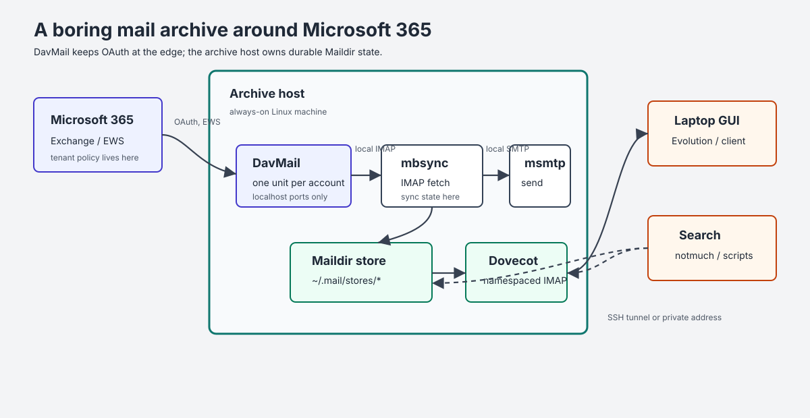
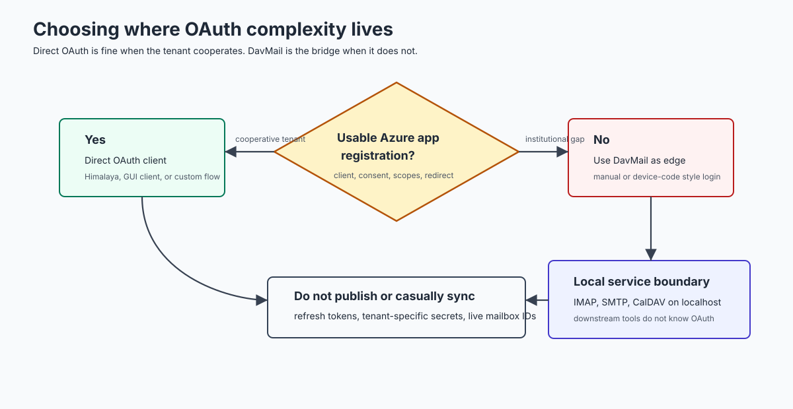
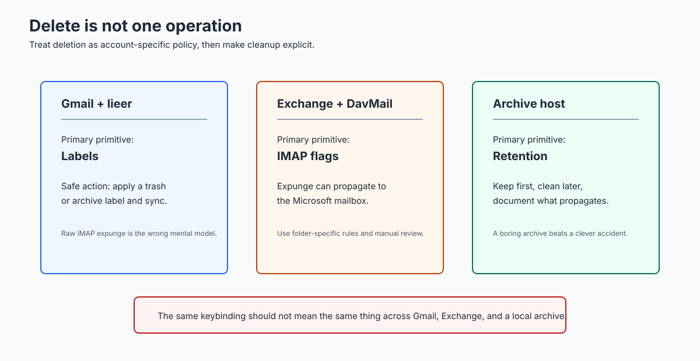

#+title: Linux Email Again: DavMail, mbsync, and a Mail Archive Host
#+author: Rohit Goswami
#+date: 2026-07-08
#+hugo_base_dir: ../
#+hugo_section: ./posts
#+export_file_name: linux-email-davmail-terra
#+hugo_custom_front_matter: :toc true :comments true
#+hugo_custom_front_matter+: :series '("Managing Email")
#+hugo_tags: rant tools email workflow linux
#+hugo_categories: personal
#+hugo_draft: true

#+begin_quote
Using DavMail as the Microsoft 365 bridge, ~mbsync~ for the archive, and a
small always-on host as the durable IMAP endpoint.
#+end_quote

* Background
The older [[/posts/reclaim-email-astroid/][Astroid mail setup]] was the right instinct: keep the mail on disk,
index it locally, and make each part of the pipeline replaceable. The part that
aged badly was not ~mbsync~, ~notmuch~, or Maildir. It was the assumption that a
single laptop should both synchronize every account and be the place where every
mail client points.

Microsoft 365 made the problem sharper. Direct OAuth is the clean answer on
paper if the institution gives you a usable Azure application registration. In
practice, that was not the world EPFL gave me. I asked for the pieces needed to
make a direct client flow boring, and the institution still did not provide a
usable path. The mailbox remained real, the replies still had to go out, and
"use the web UI" was not an acceptable answer for an archive that I expect to
survive laptops, mail clients, and institution-specific policy churn.

The working design is to isolate Microsoft 365 weirdness at the edge. DavMail
does the OAuth and Exchange work. ~mbsync~ talks plain localhost IMAP to
DavMail. The archive lives on an always-on host. Desktop mail clients then talk
to that host over an SSH tunnel or a private network address.

#+caption: The practical architecture: Microsoft 365 is handled at the edge, while the durable mail state lives on the archive host.

* Why DavMail Is Still Useful
The fashionable answer is to wire OAuth directly into the mail client. That can
be fine for a single client if the organization gives you an application
registration, client ID, consent policy, and scopes. The [[https://lobstermail.ai/blog/himalaya-oauth2-how-to-configure-it-where-it-breaks-and-when-to-skip-it][Himalaya OAuth write-up]]
is a useful tour through that version of the problem.

That approach has an operational flaw: every client becomes part of the
institutional OAuth problem. DavMail moves that boundary. It exposes normal
local IMAP, SMTP, CalDAV, CardDAV, and LDAP listeners, while it handles Exchange
or Microsoft 365 upstream. The official [[https://davmail.sourceforge.net/serversetup.html][DavMail server setup documentation]]
describes the relevant Office 365 modes, including ~O365Manual~,
~O365Interactive~, and device-code style flows. Microsoft documents the direct
IMAP/SMTP OAuth scopes separately, for example ~IMAP.AccessAsUser.All~ and
~SMTP.Send~, in the [[https://learn.microsoft.com/en-us/exchange/client-developer/legacy-protocols/how-to-authenticate-an-imap-pop-smtp-application-by-using-oauth][Exchange OAuth guidance]].

I want those details in one place, not scattered across every client I might
try. Once DavMail is running, every downstream tool sees boring local ports.

#+caption: Direct OAuth is cleaner only when the institution gives you the app registration path. DavMail is the escape hatch when it does not.

* The Archive Host
The archive host is the machine that owns mail state. In my setup, that is an
always-on Linux host with three jobs:

- Run one DavMail instance per Microsoft 365 account.
- Run ~mbsync~ into account-specific Maildir trees under =~/.mail/stores=.
- Run Dovecot so laptops can browse the consolidated archive over IMAP.

That separation matters. A laptop can be asleep, on a train, or half-broken
after a desktop upgrade. The archive host still has the mail store, the sync
state, and the service logs. A GUI client such as Evolution becomes a view over
the archive, not the owner of the data.

The Dovecot side is namespaced. One account can be the default inbox, while the
others appear as prefixes such as =work/= or =university/=. This keeps old
mailboxes usable without pretending that every account has the same deletion
rules or folder conventions.

* DavMail Properties
The properties file is sensitive configuration. It should not be checked into a
public repository. The shape is still worth documenting:

#+begin_src conf
davmail.server=false
davmail.mode=O365Manual
davmail.url=https://outlook.office365.com/EWS/Exchange.asmx

davmail.bindAddress=127.0.0.1
davmail.imapPort=1146
davmail.smtpPort=2028
davmail.caldavPort=1083
davmail.ldapPort=1392
davmail.popPort=1113

davmail.oauth.tokenFilePath=~/.config/davmail/work.token
davmail.oauth.persistToken=true
davmail.storeRefreshedToken=true

davmail.logFilePath=~/.mail/log/davmail-work.log
#+end_src

The real file may also need a public-client identifier or a DavMail-specific
OAuth setting depending on the tenant and mode. That belongs in a sealed local
configuration store together with the properties file. Refresh tokens are even
more sensitive: they should stay host-local unless you have a very deliberate
reason to back them up.

I use a per-account user service:

#+begin_src systemd
[Unit]
Description=DavMail Exchange gateway (%i)
Documentation=https://davmail.sourceforge.net/

[Service]
Type=simple
ExecStart=/usr/bin/davmail %h/.config/davmail/%i.properties
Restart=on-failure
RestartSec=10

[Install]
WantedBy=default.target
#+end_src

That gives each account its own logs, ports, token file, and restart behavior.

* mbsync
The ~mbsync~ side should point at DavMail, not at Microsoft 365. The password is
a dummy value because DavMail owns the upstream OAuth state.

#+begin_src conf
IMAPAccount work
Host localhost
User user@example.org
Pass dummy
Port 1146
Timeout 180
TLSType None
CertificateFile /etc/ssl/certs/ca-certificates.crt
AuthMechs LOGIN

IMAPStore work-remote
Account work

MaildirStore work-local
SubFolders Verbatim
Path ~/.mail/stores/work/
Inbox ~/.mail/stores/work/
Trash ~/.mail/stores/work/.Trash

Channel work
Far :work-remote:
Near :work-local:
Patterns INBOX Archive "Conversation History" Drafts Junk Sent Trash "Unsent Messages"
Create Both
SyncState *
MaxMessages 0
#+end_src

The important correction from my older setup is the path. The archive host uses
=~/.mail/stores= as the stable root. A laptop can still mount or tunnel into
that view, but it does not need to own the Maildir tree.

* Browsing From A Laptop
For GUI browsing, I use Dovecot on the archive host and an SSH tunnel:

#+begin_src bash
ssh -L 1143:127.0.0.1:143 archive-host
#+end_src

Then a local client can connect to =localhost:1143= with no transport
encryption, because the transport is the SSH tunnel. On a private network, a
TLS Dovecot listener on the archive host is also reasonable. The point is that
Evolution, Thunderbird, or a temporary debugging client no longer gets to
decide where the archive lives.

* Deletion Semantics
Deletion is the part that deserves the most paranoia. Gmail, Exchange, and a
local archive do not mean the same thing when they say "delete".

#+caption: Deletion is not one operation. Gmail labels, Exchange flags, and a local archive need different handling.

For Gmail accounts handled by ~lieer~, labels are the safe primitive. For
Exchange accounts handled through DavMail and ~mbsync~, an expunge can propagate
to the server. For the archive host, I prefer boring retention first and
explicit cleanup later. It is much easier to delete a message from an archive
after review than it is to reconstruct an institutional mailbox after a client
made a confident wrong move.

* Operations
The operational checklist is short:

- Keep each DavMail account as a separate service.
- Keep properties files sealed; keep OAuth token files host-local.
- Keep the archive under =~/.mail/stores= on the always-on host.
- Make laptops clients of Dovecot, not owners of the synchronization state.
- Run the first sync by hand and read the folder list before adding timers.
- Treat deletion as account-specific policy, not a universal keybinding.

For new Microsoft 365 accounts, the mechanical work is only a new DavMail
properties file, a free local port set, a new ~mbsync~ channel, and a Dovecot
namespace if the account should be visible through the archive IMAP server.

* Conclusions
The lesson is not that Linux email is solved. It is that the durable part of
the system should be boring. DavMail absorbs the Microsoft 365 edge case.
~mbsync~ writes Maildir. Dovecot serves the archive. Laptops and GUI clients
become replaceable views.

That is a better failure mode than asking every Linux mail client to correctly
solve institutional Microsoft OAuth, local indexing, sync state, deletion, and
long-term backups at the same time.
