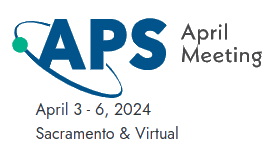
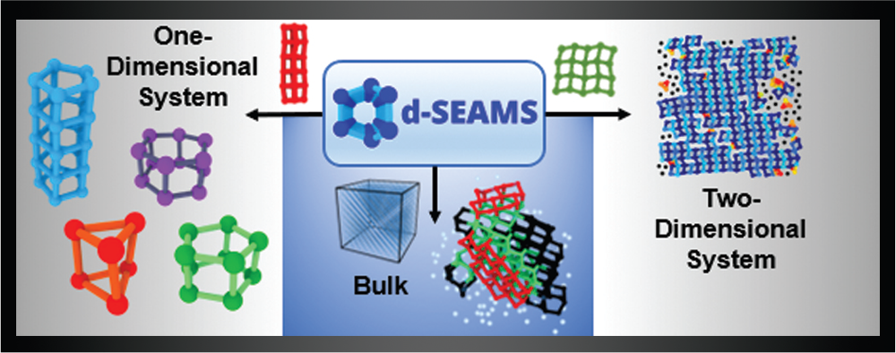
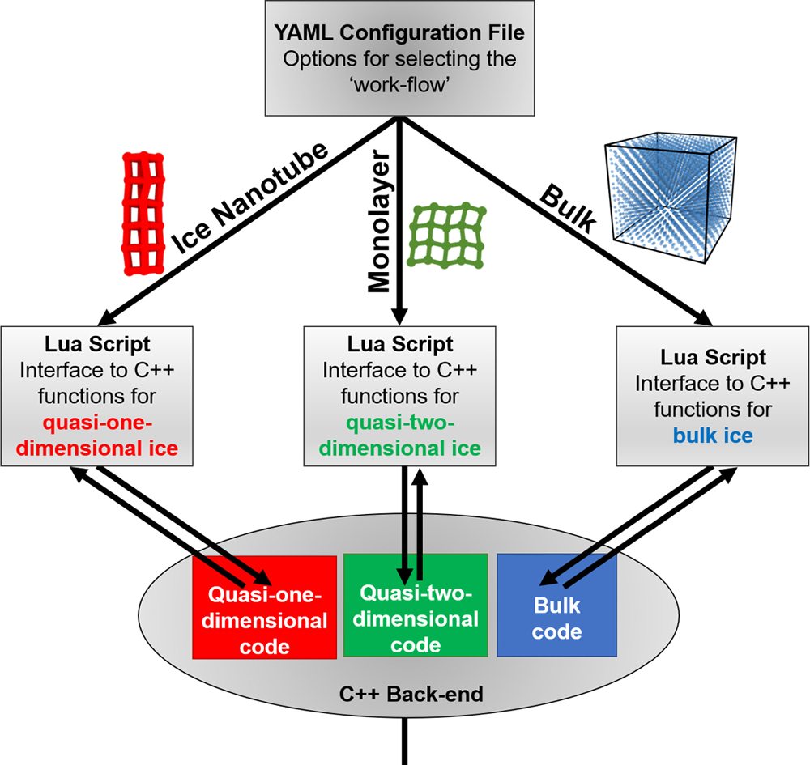
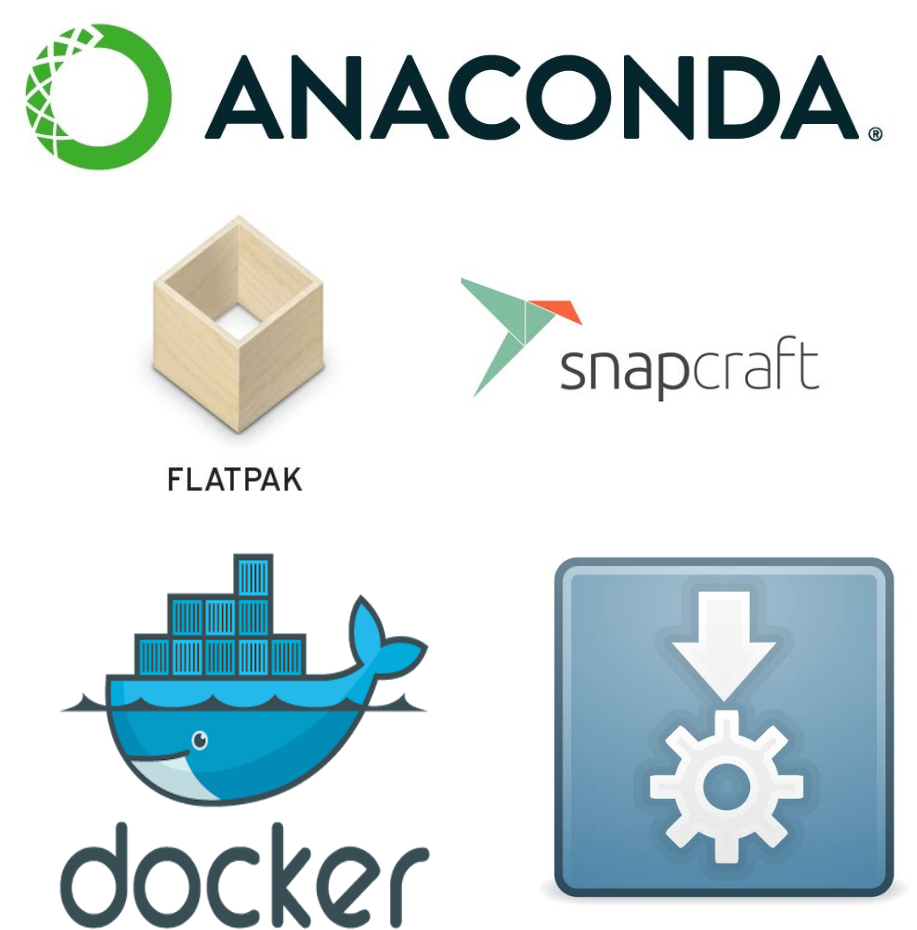
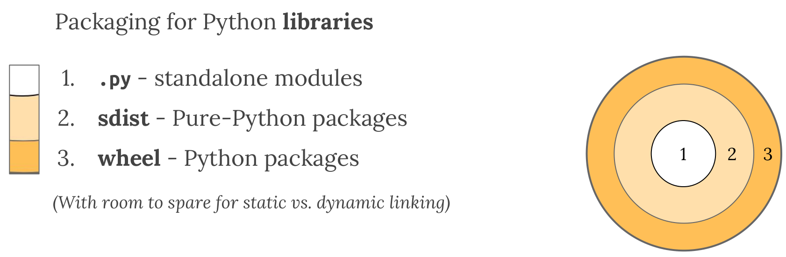
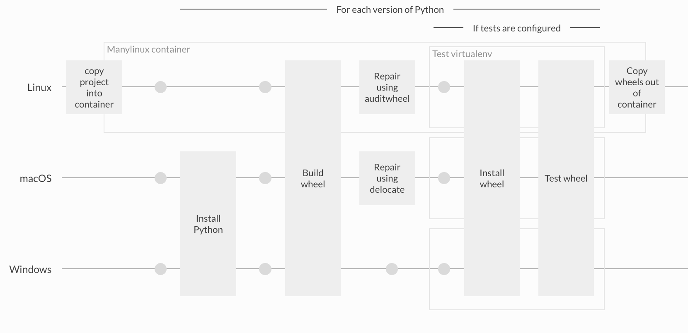

#+TITLE: PySEAMS: Pythonic Structural Elucidation Analysis for Molecular Simulations
#+SUBTITLE: Deferred Structural Elucidation Analysis for Molecular Simulations
#+AUTHOR: Rohit Goswami,\textsc{\scriptsize\ MInstP MRSC MBCS}
#+DATE:  \today
#+BEAMER_HEADER: \titlegraphic[height=1.5cm]{images/physUoI.png}{}
#+BEAMER_HEADER: \mail{rgoswami@ieee.org}

* Configuration :ignoreheading:ignore:
:PROPERTIES:
:VISIBILITY: folded
:END:

#+BEGIN_SRC emacs-lisp :exports none :eval always :results none
(require 'ox-extra)
(ox-extras-activate '(ignore-headlines))
;; Define Asynchronous Export
(defun haozeke/org-save-and-export-pdf ()
  (if (eq major-mode 'org-mode)
      (org-latex-export-to-pdf :async t)))
;; Add hook
(add-hook 'after-save-hook 'haozeke/org-save-and-export-beamer)
#+END_SRC

#
# LaTeX Stuff
#

#+DESCRIPTION:
#+KEYWORDS:
#+LANGUAGE:  en
#+OPTIONS:   TeX:t LaTeX:t skip:nil d:nil todo:t pri:nil tags:not-in-toc toc:nil
#+INFOJS_OPT: view:nil toc:nil ltoc:t mouse:underline buttons:0 path:https://orgmode.org/org-info.js
#+EXPORT_SELECT_TAGS: export
#+EXPORT_EXCLUDE_TAGS: noexport
#+LINK_UP:
#+LINK_HOME:

#+LATEX_COMPILER: xelatex
#+LATEX_HEADER: \PassOptionsToPackage{unicode=true}{hyperref}
#+LATEX_HEADER: \PassOptionsToPackage{hyphens}{url}
#+LATEX_HEADER: \PassOptionsToPackage{dvipsnames,svgnames*,x11names*,table}{xcolor}
#+LATEX_HEADER: \usepackage{amssymb,amsmath}
#+LATEX_HEADER: \usepackage{mathtools}
#+LATEX_HEADER: \usepackage{physics}
#+LATEX_HEADER: \usepackage{hyperref}
#+LATEX_HEADER: \hypersetup{
#+LATEX_HEADER:             pdftitle={Scaling    },
#+LATEX_HEADER:             pdfauthor={Author},
#+LATEX_HEADER:             pdfborder={0 0 0},
#+LATEX_HEADER:             breaklinks=true}
#+LATEX_HEADER: % Make use of float-package and set default placement for figures to H
#+LATEX_HEADER: \usepackage{float}
#+LATEX_HEADER: \floatplacement{figure}{H}

#+LATEX_HEADER: \usepackage{fontspec}
#+LATEX_HEADER: \setromanfont{EB Garamond}
#+LATEX_HEADER: \usefonttheme{serif}

#+LaTeX_CLASS: beamer
#+LaTeX_CLASS_OPTIONS: [bigger,unknownkeysallowed,aspectratio=169,blue,colorblocks]
#+startup: beamer
#+BEAMER_THEME: Verona
#+BEAMER_FRAME_LEVEL: 2
#+COLUMNS: %40ITEM %10BEAMER_env(Env) %9BEAMER_envargs(Env Args) %4BEAMER_col(Col) %10BEAMER_extra(Extra)

#+LATEX_HEADER: \usepackage[absolute,overlay]{textpos}

#+LATEX_HEADER: \newcommand*{\XOffsetFromBottomLeft}{32.5em}%
#+LATEX_HEADER: \newcommand*{\YOffsetFromBottomLeft}{2.7ex}%
#+LATEX_HEADER: \newcommand*{\BottomLeftText}[1]{%
#+LATEX_HEADER:     \par%
#+LATEX_HEADER: \scriptsize\begin{textblock*}{17.0cm}(\dimexpr\textwidth-\XOffsetFromBottomLeft\relax,\dimexpr\textheight-\YOffsetFromBottomLeft\relax)
#+LATEX_HEADER:         #1%
#+LATEX_HEADER:     \end{textblock*}%
#+LATEX_HEADER: }%
#+LATEX_HEADER:  \usepackage{tikz,pgfplots}
#+LATEX_HEADER:  \usetikzlibrary{positioning, arrows.meta, decorations.pathreplacing, calc, shapes.geometric}
#+LATEX_HEADER:  \pgfplotsset{compat=1.17}

# From https://tex.stackexchange.com/a/533755/130845
#+LATEX_HEADER: \newcommand{\pd}[2]{\frac{\partial{#1}}{\partial{#2}}}
#+LATEX_HEADER: \newcommand{\pdd}[2]{\frac{\partial^2{#1}}{\partial{#2}^2}}

# From https://tex.stackexchange.com/questions/477784/adjust-spacing-between-main-text-and-footnote-in-beamer-slides
#+LATEX_HEADER: \setbeamertemplate{footnote}{%
#+LATEX_HEADER:  \makebox[1em][l]{\insertfootnotemark}%
#+LATEX_HEADER:  \begin{minipage}{\dimexpr\linewidth-1em}
#+LATEX_HEADER:    \footnotesize\linespread{0.84}\selectfont\insertfootnotetext
#+LATEX_HEADER:  \end{minipage}\vskip 0pt}%

# References
#+LATEX_HEADER: \usepackage[doi=false,isbn=false,url=false,eprint=false]{biblatex}
#+LATEX_HEADER: \bibliography{refs.bib}

* Start Here :ignoreheading:ignore:
* Speaker
- @@latex:\small{Find me here: https://rgoswami.me}@@
  + @@latex:\small{}@@ *Rohit Goswami* MInstP MBCS MRSC
    - Doctoral Researcher :: Jónsson Group, University of Iceland
    - Software Engineer (II) :: Quansight Labs
    - Maintainer :: NumPy, ASV, d-SEAMS, Seldon

** A block :B_ignoreheading:BMCOL:
:PROPERTIES:
:BEAMER_col: 0.5
:END:

#+DOWNLOADED: screenshot @ 2024-04-03 01:04:41
#+ATTR_LaTeX: :width 0.3\linewidth

#+ATTR_LaTeX: :width 0.3\linewidth
file:./images/quansightlabs.png

** A block :B_ignoreheading:BMCOL:
:PROPERTIES:
:BEAMER_col: 0.5
:END:

#+ATTR_LaTeX: :width 0.6\linewidth
file:./images/physUoI.png
#+ATTR_LaTeX: :width 0.4\linewidth
file:./images/rannisLogo.png
#+ATTR_LaTeX: :width 0.2\linewidth
file:./images/ccLogo.png
** No Column :B_ignoreheading:
:PROPERTIES:
:BEAMER_env: ignoreheading
:END:

* d-SEAMS Overview
#+DOWNLOADED: screenshot @ 2024-04-03 01:15:58
#+ATTR_LaTeX: :width 0.5\linewidth

- Topological unit matching cite:Goswami2021,Goswami2020c
- Quantifying ice nucleation cite:prernaStudyIceNucleation2019
- fullcite:goswamiDSEAMSDeferredStructural2020

* Royal Road To Reproducibility
** A block :B_ignoreheading:BMCOL:
:PROPERTIES:
:BEAMER_col: 0.4
:END:

fullcite:communityTuringWayHandbook2019

#+ATTR_LaTeX: :width 0.4\textwidth
file:images/turingWay/LogoDetailWithText.png

** A screenshot :BMCOL:B_example:
:PROPERTIES:
:BEAMER_col: 0.6
:END:
file:images/reproducibility.png
* d-SEAMS Computational Design
** A block :B_ignoreheading:BMCOL:
:PROPERTIES:
:BEAMER_col: 0.5
:END:

#+DOWNLOADED: screenshot @ 2024-04-03 01:11:04
#+ATTR_LaTeX: :width 0.9\linewidth

** B block :B_ignoreheading:BMCOL:
:PROPERTIES:
:BEAMER_col: 0.3
:END:
- Reproducibility with ~nix~
  + ~lua~ to restrict allowed inputs
    - Domain Specific Language (DSL)
  + YAML for different underlying engines
- Somewhat overly restrictive!
* Lua Limitations
** A block :B_ignoreheading:BMCOL:
:PROPERTIES:
:BEAMER_col: 0.5
:END:

#+begin_src cpp
molSys::PointCloud<molSys::Point<double>, double> resCloud;  
lua["resCloud"] = &resCloud;  
#+end_src

#+RESULTS:

#+begin_src lua
for frame=targetFrame,finalFrame,frameGap do
resCloud=readFrameOnlyOne(...)
end
#+end_src

#+RESULTS:

** B block :B_ignoreheading:BMCOL:
:PROPERTIES:
:BEAMER_col: 0.3
:END:
- Pre-allocated C++ instances filled in ~lua~
  + Adds global state
- Limited extensibility
  + ~lua~ wraps function pointers
* Libraries can be brittle
*** Column1
:PROPERTIES:
:BEAMER_col: 0.5
:END:
- C++ matrix algebra
  + Eigen versions cannot be mixed
- Autogeneration of code is a thing now
  + JAX / PyTorch
- The library interop problem
  + LAPACK / BLAS cannot be back-propagated through
*** Image
:PROPERTIES:
:BEAMER_col: 0.5
:END:

#+ATTR_LaTeX: :width 0.6\textwidth

*** No Column :B_ignoreheading:
:PROPERTIES:
:BEAMER_env: ignoreheading
:END:
* Towards Python Bindings
** A block :B_ignoreheading:BMCOL:
:PROPERTIES:
:BEAMER_col: 0.5
:END:

#+begin_src cpp
py::class_<molSys::Point<double>>(m, "PointDouble")
.def(py::init<>())
.def_readwrite("c_type", &molSys::Point<double>::type)
.def_readwrite("atomID", &molSys::Point<double>::atomID);
#+end_src

#+RESULTS:

#+begin_src python
import cyoda
foo = cyoda.PointDouble()
bar = cyoda.PointDouble()
#+end_src

#+RESULTS:

** B block :B_ignoreheading:BMCOL:
:PROPERTIES:
:BEAMER_col: 0.3
:END:
- First class bindings
  + Allocations triggered from Python
- Templated code can be bound
  + With reasonable assumptions
* Python Packaging Gradient

Consider the packaging gradient\footnotemark
#+DOWNLOADED: screenshot @ 2020-05-22 23:00:30

- Libraries and Dev tools are all we get (from PyPI)

#+BEGIN_EXPORT latex
\footnotetext{by Mahmoud Hashemi (PyBay'17): \url{https://www.youtube.com/watch?v=iLVNWfPWAC8}}
#+END_EXPORT
* Meson I: C++ Library
#+begin_src meson
ydslib = library('yodaLib',
                ydsl_sources,
                dependencies: _deps,
                cpp_args: _args,
                include_directories : _incdirs,
                install: true
               )
yds_dep = declare_dependency(link_with: [ydslib, _linkto],
                             include_directories: _incdirs,
                             compile_args: _args,
                             dependencies: _deps)
#+end_src
* Meson II: Python bindings
** A block :B_ignoreheading:BMCOL:
:PROPERTIES:
:BEAMER_col: 0.5
:END:
#+begin_src meson
py.extension_module(
  'cyoda', # compiled bindings
  ...
  subdir: 'yodaseams/'
)
# yodaseams, main package
py.install_sources([
    'yodaseams/__init__.py',
  ],
# next to compiled extension
  pure: false,
  subdir: 'yodaseams'
)
#+end_src
** Block II :BMCOL:B_example:
:PROPERTIES:
:BEAMER_col: 0.5
:END:

#+begin_src meson
# Adapters
py.install_sources([
'yodaseams/ase_adapters.py',
'yodaseams/aux.py',
],
pure: false,
subdir: 'yodaseams'
)
#+end_src
* Distribution
#+DOWNLOADED: screenshot @ 2024-04-03 03:54:15
#+ATTR_LaTeX: :width 0.8\linewidth

#+BEGIN_EXPORT latex
\footnotetext{\texttt{cibuildwheel} docs: \url{https://cibuildwheel.pypa.io/en/latest/}}
#+END_EXPORT
* Conclusions and Future Plans
:PROPERTIES:
:BEAMER_opt: t
:END:
*** Takeaway
- Write and distribute zero copy bindings
** A block :B_ignoreheading:BMCOL:
:PROPERTIES:
:BEAMER_col: 0.4
:END:
*** Binding designs
- Minimize global state
  + Follow Liskov substitution principle
- Use ~meson~
** B block :B_ignoreheading:BMCOL:
:PROPERTIES:
:BEAMER_col: 0.4
:END:
*** Future
- Distribute wheels with ~cibuildwheel~
  + Bundle visualizations
- Add statistical learning kernels
* Acknowledgments
** A block :B_ignoreheading:BMCOL:
:PROPERTIES:
:BEAMER_col: 0.6
:END:
- Mentee :: Ruhila S. (GSoC'23)
- Coauthor :: Amrita Goswami
- Faculty :: Prof. Hannes Jónsson, Prof. Debabrata Goswami
- Funding :: Rannis IRF fellowship, Quansight Labs, Google Summer of Code 2023
- Also :: Family, Lab members, Everyone here

#+ATTR_LATEX: :options [Lewis Carroll, \textit{Alice in Wonderland}]
#+begin_quotation
Begin at the beginning, the King said gravely, ``and go on till you come to the end: then stop.''
#+end_quotation
** A screenshot :BMCOL:B_example:
:PROPERTIES:
:BEAMER_col: 0.4
:END:

#+ATTR_LaTeX: :width 0.4\textwidth
file:images/askjaVR3UTSIITK.png

** No Column :B_ignoreheading:
:PROPERTIES:
:BEAMER_env: ignoreheading
:END:

* References
:PROPERTIES:
:BEAMER_opt: allowframebreaks, noframenumbering
:END:

** No Column :B_ignoreheading:
:PROPERTIES:
:BEAMER_env: ignoreheading
:END:

\printbibliography[heading=none]

* End
:PROPERTIES:
:BEAMER_opt: standout, noframenumbering
:END:
#+BEGIN_EXPORT latex
\begin{center}
\Huge Thank you. \\
\textbf{Questions?}
\end{center}
#+END_EXPORT

# Local Variables:
# before-save-hook: org-babel-execute-buffer
# End:
